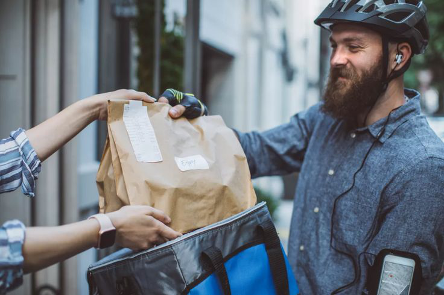

# Unwrapping Food Delivery Insights: A Call Center Restaurant Orders Analysis

## Introduction
Over the past few weeks, I took a deep dive into a food delivery dataset with 72,314 orders, involving 6,262 unique customers, 408 restaurants, and a fleet of delivery drivers. As a data analyst, my goal was to help uncover the operational strengths, challenges, and untapped opportunities in this delivery business.

Food delivery is a fast-paced game — and behind every hot meal delivered is a chain of processes that either delight customers or lead to delays and lost revenue. This project is about making sense of that.

## Problem Statement
Despite receiving thousands of orders, the business wasn’t sure where inefficiencies were creeping in:

Which drivers deliver on time and which delay orders?

Do certain areas take longer to serve than others?

Which restaurants drive the most revenue?

What’s the customer tipping behavior like?

Are customers requesting ASAP orders more often?

The business needed answers, and I was determined to find them.

## Objective
The key objectives of this project were:

Identify top-performing restaurants based on order volume and revenue.

Measure average delivery times and what influences them.

Analyze driver performance, particularly around tip amounts and delivery efficiency.

Analyze driver performance, particularly around tip amounts and delivery efficiency.

Discover customer preferences, including ASAP requests and popular delivery areas.

Provide actionable recommendations to improve customer experience and delivery operations.

## Data Source
The dataset was provided in Excel and uploaded to SQL Server Management Studio for querying. It contains timestamped order records, delivery details, financial figures (tips, discounts, fees), and driver/customer IDs.

Key columns included:

Date, Time_order_placed_at_restaurant, Time_driver_arrived_at_restaurant,Delivery_time

Driver_ID, Driver_Name, Customer_ID, Restaurant_ID, Delivery_Area

Sub_Total, Tip, Delivery_fee, ASAP (order urgency)

## Skills Demonstrated
SQL Querying (JOINs, GROUP BY, DATEDIFF, Aggregation)

Exploratory Data Analysis (EDA) using SQL

Data Cleaning (handling NULLs, formatting issues)

KPI Reporting (revenue, tips, delivery time, customer behavior)

Storytelling with Data (insightful narrative presentation)

Problem-Solving (translating business challenges into queries)

## Insights Drawn
Here are some of the most eye-opening discoveries:

### Key Metrics(KPIs)
* Total Orders 72314
* Total Customers 6262
* Total Drivers 432
* Unique Restaurants 408

```
--Orders per Restaurant
	SELECT 
    [Restaurant_ID], 
    COUNT(*) AS Total_Orders
FROM 
    [Call-Center_Restaurant-Orders_Challenge]
GROUP BY 
    [Restaurant_ID]
ORDER BY 
    Total_Orders DESC; 
```
1.Top Performing Restaurants
Based on total orders, Restaurant ID 7320 leads with 256 orders, showing high demand and customer preference. A total of 9 restaurants had over 230 orders, indicating they are consistent performers. These restaurants may be driving a significant portion of revenue and should be prioritized in operational planning and partnerships.However, high volume didn’t always equal high revenue.

```
SELECT 
    Restaurant_ID, 
    COUNT(*) AS Total_Orders
FROM 
    [Call-Center_Restaurant-Orders_Challenge]
GROUP BY 
    Restaurant_ID
ORDER BY 
    Total_Orders DESC;
```

2. Top Revenue Contributors
While total order count is important, total revenue is more valuable to the business. Here, Restaurant ID 7062 leads in delivery revenue at $1423.40 and subtotal at $21,994. This highlights it as a high-value partner. Others like 7208 revenue $1412.94 and subtotal $19988.50, 7123,7113,7240 also contribute significantly despite fewer total orders, suggesting larger average order values.
```
--Restaurant that generate more delivery Revenue fee and Sub total
	SELECT 
    [Restaurant_ID], 
    SUM(Delivery_fee) AS Delivery_Revenue,
	SUM(Sub_Total) AS Total_Subtotal
FROM 
    [Call-Center_Restaurant-Orders_Challenge]
GROUP BY 
    [Restaurant_ID]
ORDER BY 
    Delivery_Revenue DESC;
```

3. Top 5 Restaurants by Revenue
Certain restaurants consistently outperformed others. These top spots not only had the most orders but also generated significantly higher delivery fees and tips.

4. Driver Performance
Some drivers consistently received more tips than others. Drivers with quicker delivery times were often rewarded more — highlighting the link between speed and customer satisfaction, the Top five(5) drivers and tips collected are:
* Laura - $2365.070003...
* Marilyn - $2351.2299...
* Patricia - $2336.1399...
* Sheila - $2324.4999...
* Chelsea - $2321.4700..

```
-- Total_Tips collected by Driver
SELECT TOP 5
    [Driver_Name], 
    SUM(Tip) AS Total_Tips
FROM 
    [Call-Center_Restaurant-Orders_Challenge]
GROUP BY 
    [Driver_Name]
ORDER BY 
    Total_Tips DESC;
```

5. Average tip collected by driver- Each driver is believed to have gotten an average of $9.4945... in tips
```
--Average Tips
SELECT AVG(Tip) AS Avg_Tip_Per_Order
FROM [Call-Center_Restaurant-Orders_Challenge]
```

6. Deliveries  carried out by Driver.
* Doris-244
* Bailey-244
* Patricia - 240
* Laura -240
* Chelsea - 240
* Erin -240
* Bonie -236
```

--No of Delivery Per Driver
SELECT 
    [Driver_Name], 
    COUNT(*) AS Total_Deliveries
FROM 
    [Call-Center_Restaurant-Orders_Challenge]
GROUP BY 
    [Driver_Name]
ORDER BY 
    Total_Deliveries DESC;
```

7. Revenue distribution across the months
_Note: We have just three months across this year 2020_
However the month of April witnessed higher revenue inflow in terms of delivery fee
+ January - $72591.1200....
+ Febuary - $99438.6399... 
+ March - $109601.3800...
+ April - $124117.10003308
```
--Which Month had the highest delivery revenue?
	SELECT 
    FORMAT([Date], 'yyyy-MM') AS Month,
    SUM(Delivery_fee) AS Total_Delivery_Revenue
FROM 
    [Call-Center_Restaurant-Orders_Challenge]
GROUP BY 
    FORMAT([Date], 'yyyy-MM')
ORDER BY 
    Total_Delivery_Revenue DESC;
```
* Monthly tips and delivery
```--Monthly Total Tips and Delivery fees
SELECT 
    FORMAT([Date], 'yyyy-MM') AS Month,
    SUM(Tip) AS Total_Tips,
    SUM(Delivery_fee) AS Total_Delivery_Fee
FROM 
    [Call-Center_Restaurant-Orders_Challenge]
WHERE 
    [Date] BETWEEN '2024-01-01' AND '2024-12-31'
GROUP BY 
    FORMAT([Date], 'yyyy-MM')
ORDER BY 
    Month;
```
8.  Delivery Time Pattern by Driver Month and Area.

The following drivers although having had fewer deliveries by those who got more order and tip are noted for theur swift delivery time
+ Andrea - 132 Deliveries Avg_Delivery Minute -162
+ Sandra - 144 Deliveries Avg_Delivery Minute - 168
+ Courtney - 140 Deliveries Avg_Delivery Minute - 165
+ Kate - 183 Deliveries Avg_Delivery Minute - 158
+ Michele - 184 Deliveries Avg_Delivery Minute - 156
+ Leah - 144 Deliveries Avg_Delivery Minute - 169
+ Jesse  - 168 Deliveries Avg_Delivery Minute - 168
+ Kara - 144 Deliveries Avg_Delivery Minute - 165
+ Juan -  183 Deliveries Avg_Delivery Minute - 158
+ Tasha - 184 Deliveries Avg_Delivery Minute - 156
```
--Drivers that deliver food on time
SELECT 
    Driver_ID,
    Driver_Name,
    COUNT(*) AS Total_Deliveries,
    AVG(DATEDIFF(MINUTE, Time_order_placed_at_restaurant, Time_driver_arrived_at_restaurant)) AS Avg_Delivery_Time_Minutes
FROM 
    [Call-Center_Restaurant-Orders_Challenge]
WHERE 
    Time_order_placed_at_restaurant IS NOT NULL AND
    Time_driver_arrived_at_restaurant IS NOT NULL
GROUP BY 
    Driver_ID, Driver_Name
ORDER BY 
    Avg_Delivery_Time_Minutes ASC; -- Fastest drivers at top
```
--Average delivery time by Area
```
SELECT 
    Delivery_Area,
    COUNT(*) AS Total_Deliveries,
    AVG(DATEDIFF(MINUTE, Time_order_placed_at_restaurant, Time_driver_arrived_at_restaurant)) AS Avg_Delivery_Time_Minutes
FROM 
    [Call-Center_Restaurant-Orders_Challenge]
WHERE 
    Time_order_placed_at_restaurant IS NOT NULL AND
    Time_driver_arrived_at_restaurant IS NOT NULL
GROUP BY 
    Delivery_Area
ORDER BY 
    Avg_Delivery_Time_Minutes ASC;
```
```
--Monthly Total Tips and Delivery fees
SELECT 
    FORMAT([Date], 'yyyy-MM') AS Month,
    SUM(Tip) AS Total_Tips,
    SUM(Delivery_fee) AS Total_Delivery_Fee
FROM 
    [Call-Center_Restaurant-Orders_Challenge]
WHERE 
    [Date] BETWEEN '2024-01-01' AND '2024-12-31'
GROUP BY 
    FORMAT([Date], 'yyyy-MM')
ORDER BY 
    Month;
```
+ Delivery times varied significantly by area. Densely populated or hard-to-reach neighborhoods had higher delivery time averages.
```
--Average delivery time by Area
SELECT 
    Delivery_Area,
    COUNT(*) AS Total_Deliveries,
    AVG(DATEDIFF(MINUTE, Time_order_placed_at_restaurant, Time_driver_arrived_at_restaurant)) AS Avg_Delivery_Time_Minutes
FROM 
    [Call-Center_Restaurant-Orders_Challenge]
WHERE 
    Time_order_placed_at_restaurant IS NOT NULL AND
    Time_driver_arrived_at_restaurant IS NOT NULL
GROUP BY 
    Delivery_Area
ORDER BY 
    Avg_Delivery_Time_Minutes ASC;

```
```--Peak order time
SELECT 
    DATEPART(HOUR, [Time_customer_placed_order]) AS Order_Hour,
    COUNT(*) AS Total_Orders
FROM 
    [Call-Center_Restaurant-Orders_Challenge]
GROUP BY 
    DATEPART(HOUR, [Time_customer_placed_order])
ORDER BY 
    Total_Orders DESC;
```
```
--Peak order time
SELECT 
    DATEPART(HOUR, [Time_customer_placed_order]) AS Order_Hour,
    COUNT(*) AS Total_Orders
FROM 
    [Call-Center_Restaurant-Orders_Challenge]
GROUP BY 
    DATEPART(HOUR, [Time_customer_placed_order])
ORDER BY 
    Total_Orders DESC;
```
+ This query focuses on order placement efficiency by computing the average time between when the customer placed the order and when the restaurant recorded it. Interestingly, the results reveal negative average placement times across all restaurants, suggesting either systematic delays in logging timestamps or possible reverse order in event tracking. Restaurants-ID like 7213 and 7197 lead in order volume and efficiency with average lags of -64 and -63 minutes respectively, positioning them as the most efficient in terms of responsiveness. This analysis helps identify both high-performing restaurants and areas where data quality improvements are needed for more accurate operational insights.
```
--Restaurant that place orders quickly
SELECT 
    Restaurant_ID,
    COUNT(*) AS Total_Orders,
    AVG(DATEDIFF(MINUTE, Time_customer_placed_order, Time_order_placed_at_restaurant)) AS Avg_Order_Placement_Time_Minutes
FROM 
    [Call-Center_Restaurant-Orders_Challenge]
WHERE 
    Time_customer_placed_order IS NOT NULL AND
    Time_order_placed_at_restaurant IS NOT NULL
GROUP BY 
    Restaurant_ID
ORDER BY 
    Avg_Order_Placement_Time_Minutes ASC; -- Most efficient restaurants at top
```
9. Area with more Orders and Deliveries
significantly Fremont has a total 4025  customers, Hayward - 3975, Union city -3956.
```	--Which Area has more deliveries
SELECT 
    [Delivery_Area],
    COUNT(*) AS Total_Deliveries
FROM 
    [Call-Center_Restaurant-Orders_Challenge]
GROUP BY 
    [Delivery_Area]
ORDER BY 
    Total_Deliveries DESC;
```
4.  ASAP Orders Dominate
Many customers chose the “ASAP” option, emphasizing their need for speed. This urgency could be used to prioritize dispatching strategies.
```
	--Which Area has more deliveries
SELECT 
    [Delivery_Area],
    COUNT(*) AS Total_Deliveries
FROM 
    [Call-Center_Restaurant-Orders_Challenge]
GROUP BY 
    [Delivery_Area]
ORDER BY 
    Total_Deliveries DESC;
```

5.  Delivery Area Patterns
Some areas received far more deliveries than others identifying key zones that should have more dedicated drivers for efficiency.
+ Fremont 24229
+ Hayward 24085
+ Union city 24000
```
	--Which Area has more deliveries
SELECT 
    [Delivery_Area],
    COUNT(*) AS Total_Deliveries
FROM 
    [Call-Center_Restaurant-Orders_Challenge]
GROUP BY 
    [Delivery_Area]
ORDER BY 
    Total_Deliveries DESC;
```
## Recommendations
* Reward high-performing drivers (by tips or delivery time) to maintain quality.

* Collaborate more with high-revenue restaurants, even if their order counts are lower.

* Optimize driver routes for areas with longer delivery times.

* Consider pre-positioning drivers during peak "ASAP" request times.

* Perform monthly reviews of performance metrics to identify seasonal patterns.

## Conclusion
This project was more than just running SQL queries — it was about telling a story with data, listening to what the numbers were saying, and helping the business serve its customers better. With insights in hand, the business can now optimize delivery operations, boost revenue, and increase customer satisfaction.

For me, this was a rewarding journey that sharpened my analytical thinking and SQL skills. And I’m excited for the next problem to solve.

