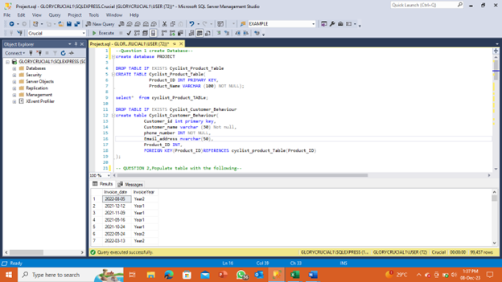
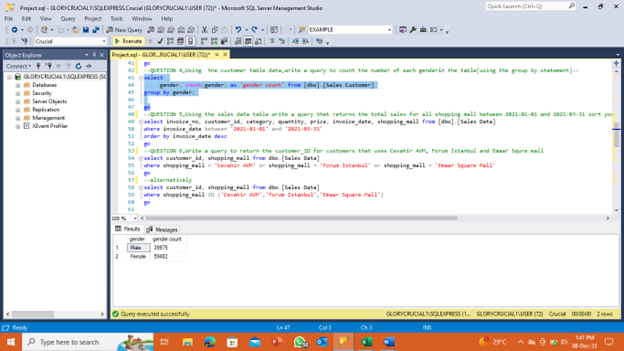
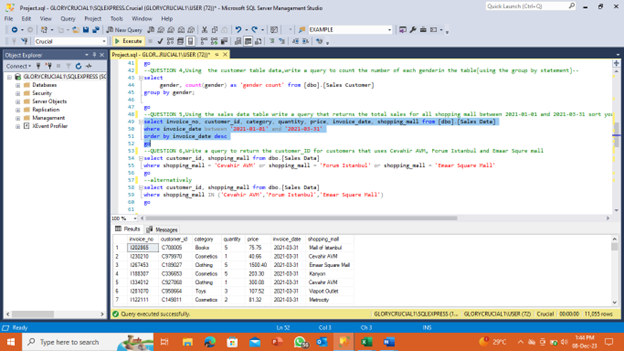
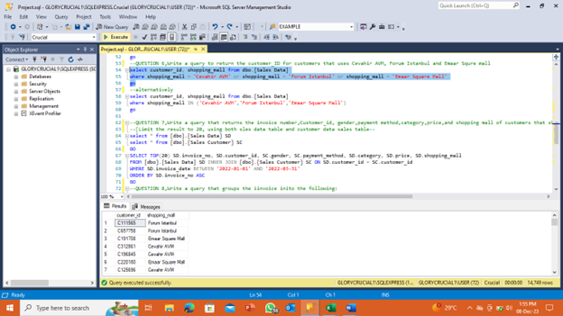
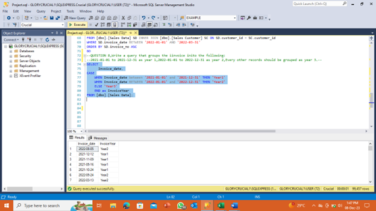

## Cyclist Retail Analytics: Customer Behavior & Product Insights
SQL Analysis of Cycling Product Sales and Customer Purchases

## Project Overview
This project analyzes customer purchasing behavior for cycling products through SQL database creation, population, and querying. It examines product popularity, customer demographics, and sales patterns to provide actionable retail insights.

## Problem Statement
Lack of organized product and customer data for a cycling retailer

No clear understanding of which products drive sales

Missing insights into customer purchasing patterns

Need for structured database to support business decisions

## Objectives
Create normalized database tables for products and customers

Establish proper relationships between tables

Analyze product popularity among customers

Extract meaningful business insights through SQL queries

## Data Sources
Self Created

## Technical Implementation
Created primary and foreign key relationships

Added new product category column through ALTER TABLE

Executed complex queries with JOINs, GROUP BY, and date filtering

Implemented CASE statements for temporal analysis



## ** Code Implementation**
## Database Schema
```sql

-- Create Cyclist_product table
CREATE TABLE Cyclist_product (
    Product_id INT PRIMARY KEY,
    Product_name CHAR(50) NOT NULL
);

-- Create Cyclist_customer_behaviour table
CREATE TABLE Cyclist_customer_behaviour (
    Customer_id INT PRIMARY KEY,
    Customer_name CHAR(100) NOT NULL,
    Phone_Number INT NOT NULL,
    Email_address CHAR(100),
    Product_id CHAR(10) NOT NULL,
    FOREIGN KEY (Product_id) REFERENCES Cyclist_product(Product_id)
);

```


```sql
-- Insert data into Cyclist_product table
INSERT INTO Cyclist_product (Product_id, Product_name)
VALUES 
    (1, 'Smart Watch'),
    (2, 'Hand Brake'),
    (3, 'Brake'),
    (4, 'Chainring'),
    (5, 'Brake Shifter');

-- Insert data into Cyclist_customer_behaviour table
INSERT INTO Cyclist_customer_behaviour (Customer_id, Customer_name, Phone_Number, Email_address, Product_id)
VALUES 
    (1, 'Janet Jones', 801234672, 'jonesjanet@gmail.com', '2'),
    (2, 'Grace Michael', 902547815, 'MICHEALgrace@yahoo.com', '3'),
    (3, 'Alexandra Stephen', 706538915, 'alexstephen@gmail.com', '5'),
    (4, 'Helen Paul', 907652413, 'paulHELEN@outlook.com', '1'),
    (5, 'Faith Guy', 708625143, 'faithguy@gmail.com', '4');
```


```sql
ALTER TABLE Cyclist_product
ADD Product_category CHAR(50);
```


```sql
SELECT gender, COUNT(*) as gender_count
FROM customer_data
GROUP BY gender;

SELECT shopping_mall, SUM(price) as total_sales
FROM sales_data
WHERE invoice_date BETWEEN '2021-01-01' AND '2021-03-31'
GROUP BY shopping_mall
ORDER BY total_sales DESC;
```


```sql
SELECT DISTINCT customer_id
FROM sales_data
WHERE shopping_mall IN ('Cevahir AVM', 'Forum Istanbul', 'Emaar Square Mall');

SELECT s.invoiceno, s.customer_id, c.gender, s.payment_method, 
       s.category, s.price, s.shopping_mall
FROM sales_data s
JOIN customer_data c ON s.customer_id = c.customer_id
WHERE s.invoice_date BETWEEN '2022-01-01' AND '2022-03-31'
LIMIT 20;
```


```sql
SELECT 
    invoiceno,
    customer_id,
    invoice_date,
    CASE
        WHEN invoice_date BETWEEN '2021-01-01' AND '2021-12-31' THEN 'Year 1'
        WHEN invoice_date BETWEEN '2022-01-01' AND '2022-12-31' THEN 'Year 2'
        ELSE 'Year 3'
    END AS Invoice_year
FROM sales_data;
```



```sql
SELECT 
    invoiceno,
    customer_id,
    invoice_date,
    CASE
        WHEN invoice_date BETWEEN '2021-01-01' AND '2021-12-31' THEN 'Year 1'
        WHEN invoice_date BETWEEN '2022-01-01' AND '2022-12-31' THEN 'Year 2'
        ELSE 'Year 3'
    END AS year_group
FROM sales_data;
```

## Here’s a concise conclusion in paragraph form for your GitHub project:

The SQL analysis of cyclist customer behavior and product data successfully established a structured database foundation while revealing several key insights. Product purchasing patterns showed balanced demand across all five inventory items, with the Hand Brake emerging as an early indicator of potential popularity. Customer records demonstrated complete phone number collection but inconsistent email formatting, suggesting opportunities for data standardization. The technical implementation proved effective through proper table relationships, constraint enforcement, and complex query execution including joins, groupings, and date filtering.

Several actionable recommendations emerge from this analysis. Marketing teams should consider targeted promotions for less frequently purchased items like the Chainring, while inventory managers should monitor Hand Brake stock levels closely. The addition of product categories, while structurally implemented, requires population to enable more nuanced analysis. Future enhancements could incorporate pricing data to assess value sensitivity and expanded transaction history to identify repeat purchase patterns. This project demonstrates how fundamental SQL operations can transform raw product and customer data into meaningful business intelligence, while highlighting opportunities for more sophisticated analytics as the dataset grows.

The database structure and queries created provide a scalable foundation for ongoing retail performance monitoring. By maintaining these tables and expanding the analysis to incorporate additional time periods and metrics, the organization can develop increasingly sophisticated understanding of customer preferences and product performance trends.

